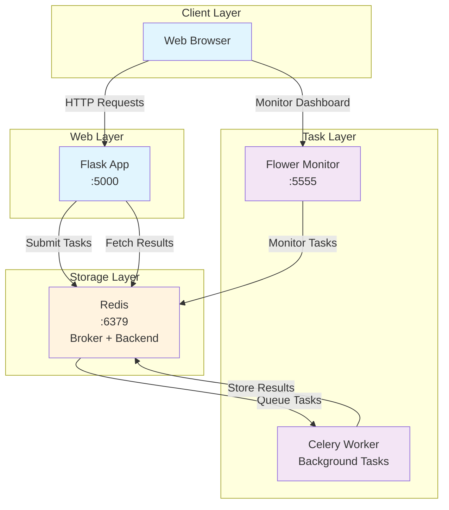

# Flask + Celery + Redis + Flower Demo

A complete demonstration of asynchronous task processing using Flask, Celery, Redis, and Flower for monitoring.

## Architecture Overview



## Component Description

| Component | Purpose | Port | Technology |
|-----------|---------|------|------------|
| **Flask App** | Web interface for task submission | 5000 | Python Flask |
| **Celery Worker** | Background task processor | - | Celery |  
| **Redis** | Message broker & result backend | 6379 | Redis Server |
| **Flower** | Task monitoring dashboard | 5555 | Celery Flower |

## Project Structure

```text
src/
├── app.py              # Flask web application
├── tasks.py            # Celery task definitions  
├── make_celery.py      # Celery worker entry point
├── templates/
│   └── home.html       # Web interface template
├── static/
│   └── style.css       # Application styles
└── logs/
    └── celery.log      # Worker logs
```

## Quick Start

### 1. Install Dependencies

```bash
# Install Poetry if you haven't already
curl -sSL https://install.python-poetry.org | python3 -

# Install project dependencies
poetry install
```

### 2. Start Redis Server

```bash
# Check if Redis is running
redis-cli ping

# If no PONG response, start Redis
redis-server --daemonize yes
```

### 3. Run All Services

#### Option A: Automatic (All in Background)

```bash
# Start all services automatically
cd src
poetry run celery -A make_celery worker --pool=solo --loglevel=info -f logs/celery.log &
poetry run celery -A make_celery flower --port=5555 &
cd .. && poetry run flask --app src/app --debug run
```

#### Option B: Manual (Separate Terminals)

**Terminal 1 - Celery Worker:**

```bash
cd src
poetry run celery -A make_celery worker --pool=solo --loglevel=info -f logs/celery.log
```

**Terminal 2 - Flower Monitor:**

```bash
cd src  
poetry run celery -A make_celery flower --port=5555
```

**Terminal 3 - Flask App:**

```bash
poetry run flask --app src/app --debug run
```

## Access Points

| Service | URL | Description |
|---------|-----|-------------|
| **Flask Web App** | <http://127.0.0.1:5000> | Main application interface |
| **Flower Dashboard** | <http://127.0.0.1:5555> | Task monitoring and management |

## Features

### Available Tasks

1. **Division Task** - Mathematical division with progress tracking
2. **Text Processing Task** - Text transformation with repeat functionality

### Demo Capabilities

- ✅ **Task Submission** - Submit background tasks via web interface
- ✅ **Progress Tracking** - Real-time task progress updates
- ✅ **Error Handling** - Graceful error management and user feedback  
- ✅ **Result Display** - View task results and status
- ✅ **Live Monitoring** - Monitor tasks in Flower dashboard

### Testing Tasks Manually

```python
# Start Flask shell
poetry run flask shell

# Submit division task
from tasks import divide
task = divide.delay(10, 2)
print(f"Task ID: {task.id}, Status: {task.status}")

# Submit text processing task  
from tasks import process_text
task = process_text.delay("Hello World", 3)
print(f"Task ID: {task.id}, Status: {task.status}")
```

## Architecture Benefits

- **Scalability**: Tasks processed asynchronously without blocking web requests
- **Reliability**: Redis provides persistent message queuing and result storage  
- **Monitoring**: Flower dashboard offers real-time task visibility
- **Flexibility**: Easy to add new task types and scale workers

## References

- [Flask-Celery Integration Patterns](https://flask.palletsprojects.com/en/3.0.x/patterns/celery/)
- [Celery Best Practices](https://docs.celeryq.dev/en/stable/userguide/tasks.html)
- [Redis Configuration](https://redis.io/documentation)
- [Flower Monitoring](https://flower.readthedocs.io/en/latest/)

---

**Perfect for learning Flask + Celery + Redis + Flower integration! 🚀**
